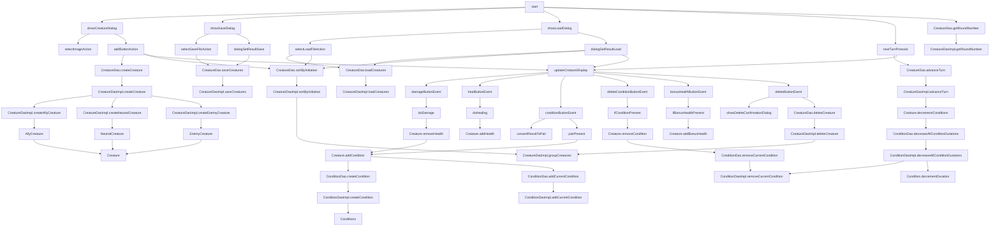

```mermaid
graph TD;
start-->showCreatureDialog;
    showCreatureDialog-->selectImageAction;
    showCreatureDialog-->addButtonAction;
        addButtonAction-->CreatureDao.createCreature;
            CreatureDao.createCreature-->CreatureDaoImpl.createCreature;
                CreatureDaoImpl.createCreature-->CreatureDaoImpl.createAllyCreature;
                    CreatureDaoImpl.createAllyCreature-->AllyCreature;
                        AllyCreature-->Creature;
                CreatureDaoImpl.createCreature-->CreatureDaoImpl.createNeutralCreature;
                    CreatureDaoImpl.createNeutralCreature-->NeutralCreature;
                        NeutralCreature-->Creature;
                CreatureDaoImpl.createCreature-->CreatureDaoImpl.createEnemyCreature;
                    CreatureDaoImpl.createEnemyCreature-->EnemyCreature;
                        EnemyCreature-->Creature;
        addButtonAction-->CreatureDao.sortByInitiative;
            CreatureDao.sortByInitiative-->CreatureDaoImpl.sortByInitiative;
                CreatureDaoImpl.sortByInitiative-->CreatureDaoImpl.groupCreatures;
        addButtonAction-->updateCreatureDisplay;
            updateCreatureDisplay-->damageButtonEvent;
                damageButtonEvent-->doDamage;
                    doDamage-->Creature.removeHealth;
                        Creature.removeHealth-->Creature.addCondition;
                            Creature.addCondition-->ConditionDao.createCondition;
                                ConditionDao.createCondition-->ConditionDaoImpl.createCondition;
                                    ConditionDaoImpl.createCondition-->Conditions;
                            Creature.addCondition-->ConditionDao.addCurrentCondition;
                                ConditionDao.addCurrentCondition-->ConditionDaoImpl.addCurrentCondition;
            updateCreatureDisplay-->healButtonEvent;
                healButtonEvent-->doHealing;
                    doHealing-->Creature.addHealth;
            updateCreatureDisplay-->conditionButtonEvent;
                conditionButtonEvent-->convertResultToPair;
                conditionButtonEvent-->pairPresent;
                    pairPresent-->Creature.addCondition;
            updateCreatureDisplay-->deleteConditionButtonEvent;
                deleteConditionButtonEvent-->ifConditionPresent;
                    ifConditionPresent-->Creature.removeCondition;
                        Creature.removeCondition-->ConditionDao.removeCurrentCondition;
                            ConditionDao.removeCurrentCondition-->ConditionDaoImpl.removeCurrentCondition
            updateCreatureDisplay-->bonusHealthButtonEvent;
                bonusHealthButtonEvent-->ifBonusHealthPresent;
                    ifBonusHealthPresent-->Creature.addBonusHealth;
            updateCreatureDisplay-->deleteButtonEvent;
                deleteButtonEvent-->showDeleteConfirmationDialog;
                deleteButtonEvent-->CreatureDao.deleteCreature;
                    CreatureDao.deleteCreature-->CreatureDaoImpl.deleteCreature;
                        CreatureDaoImpl.deleteCreature-->CreatureDaoImpl.groupCreatures;
start-->showSaveDialog;
    showSaveDialog-->selectSaveFileAction;
        selectSaveFileAction-->CreatureDao.saveCreatures;
            CreatureDao.saveCreatures-->CreatureDaoImpl.saveCreatures
    showSaveDialog-->dialogSetResultSave;
        dialogSetResultSave-->CreatureDao.saveCreatures;
start-->showLoadDialog;
    showLoadDialog-->selectLoadFileAction;
        selectLoadFileAction-->CreatureDao.loadCreatures;
            CreatureDao.loadCreatures-->CreatureDaoImpl.loadCreatures;
        selectLoadFileAction-->CreatureDao.sortByInitiative;
    showLoadDialog-->dialogSetResultLoad;
        dialogSetResultLoad-->CreatureDao.loadCreatures;
        dialogSetResultLoad-->CreatureDao.sortByInitiative;
        dialogSetResultLoad-->updateCreatureDisplay;
start-->nextTurnPressed;
    nextTurnPressed-->CreatureDao.advanceTurn;
        CreatureDao.advanceTurn-->CreatureDaoImpl.advanceTurn;
            CreatureDaoImpl.advanceTurn-->Creature.decrementConditions;
                Creature.decrementConditions-->ConditionDao.decreaseAllConditionDurations;
                    ConditionDao.decreaseAllConditionDurations-->ConditionDaoImpl.decreaseAllConditionDurations;
                        ConditionDaoImpl.decreaseAllConditionDurations-->ConditionDaoImpl.removeCurrentCondition;
                        ConditionDaoImpl.decreaseAllConditionDurations-->Condition.decrementDuration;
    nextTurnPressed-->updateCreatureDisplay;
start-->CreatureDao.getRoundNumber;
    CreatureDao.getRoundNumber-->CreatureDaoImpl.getRoundNumber
```

